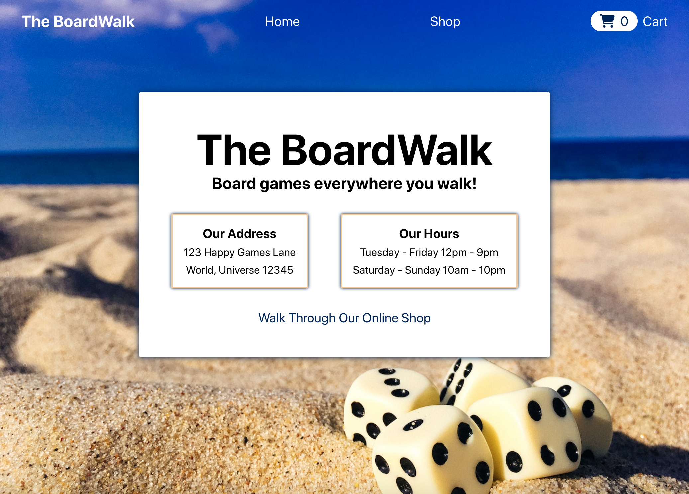

# The BoardWalk Shopping App

## Introduction

This project is a mock front-end interface for a shopping app with the ability to add items to a shopping cart. It is built using React.

The project primarily demonstrates use of React client-side routing and basic testing of UI elements with Testing Library packages.

## Preview

Run this project [here](https://xsherryhe.github.io/shopping-cart/).

## Image Credits

1) lucharanger2018 on Pixabay  
https://pixabay.com/photos/monopoly-game-board-piece-fun-3427599/

2) Sheila Sund on PxHere  
https://pxhere.com/en/photo/521688

3) Derek Bruff on Flickr  
https://www.flickr.com/photos/derekbruff/29380785692  
https://www.flickr.com/photos/derekbruff/31132319005

4) wokandapix on Pixabay  
https://pixabay.com/photos/scrabble-education-text-read-921255/

5) PDPics on Pixabay  
https://pixabay.com/photos/card-game-game-cards-black-white-167051/

6) kaenie on Pixabay  
https://pixabay.com/photos/board-game-ticket-to-ride-game-1163742/

7) dograapps on Pixabay  
https://pixabay.com/photos/game-board-catan-leisure-340574/

8) trenttsd on Flickr  
https://www.flickr.com/photos/84335369@N00/8096864091/

9) MeoplesMagazine on Flickr  
https://www.flickr.com/photos/meoplesmagazine/49627743951/  
https://www.flickr.com/photos/meoplesmagazine/48600940241/

10) Brian Gray on Flickr  
https://www.flickr.com/photos/urbanbohemian/29556376706

11) David Goehring on Flickr  
https://www.flickr.com/photos/carbonnyc/528632388

12) Balázs Utasi on Pexels  
https://www.pexels.com/photo/five-dice-on-sand-998679/

13) nikolabelopitov on Pixabay  
https://pixabay.com/photos/sand-pattern-waves-dunes-2005066/

14) karishea on Pixabay  
https://pixabay.com/photos/christmas-presents-gifts-holiday-5842973/
